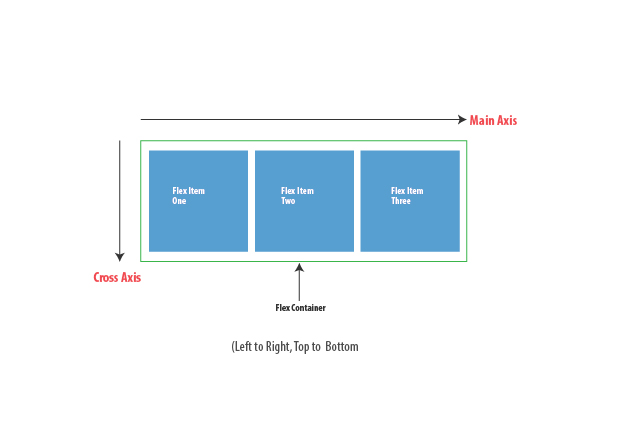
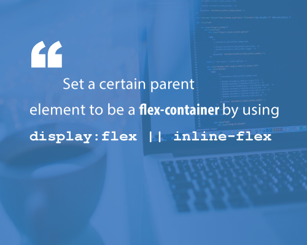

# Summary
> Direction Agnostic  
> Flexible  
> Efficient way to layout, align, and distribute space

# Terms
  

# How to start?

# The Flex Container Properties
> flex-direction: `row` | `column` | `row-reverse` | `column-reverse`  
> flex-wrap: `wrap` | `nowrap` | `wrap-reverse`  
> justify-content: `flex-start` | `flex-end` | `center` | `space-between` | `space-around`  
> align-items: `flex-start` | `flex-end` | `center` | `stretch` | `baseline`  

# The Flex Item Properties
> order: <number>
> flex-grow: <number>
> flex-shrink: <number>
> flex-basis: <width>

